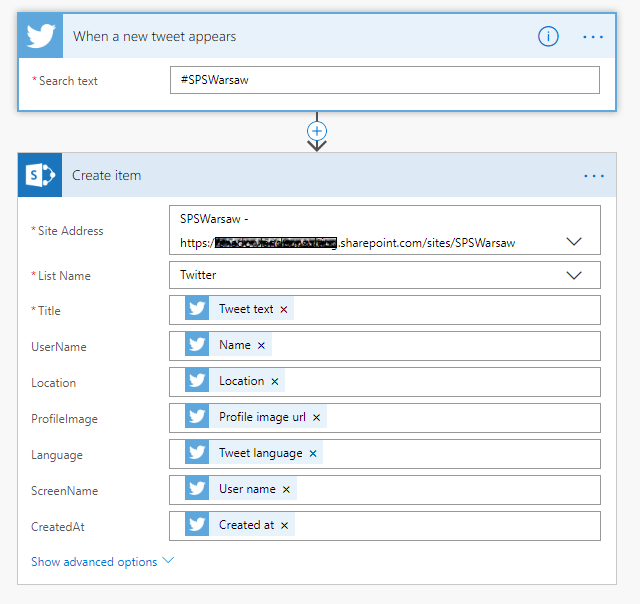

#SPFx Twitter Demo
## Summary

The web part is showing tweets from the SharePoint list. 
Tweets are added to the list via Microsoft Flow

## MockData


## SharePoint List


## List settings
Twitter list have a columns:
* Title
* UserName
* Location
* ProfileImage
* Language
* ScreenName
* CreatedAt

## Microsoft Flow



## Building the code

```bash
git clone the repo
npm i
npm i -g gulp
gulp
```

This package produces the following:

* lib/* - intermediate-stage commonjs build artifacts
* dist/* - the bundled script, along with other resources
* deploy/* - all resources which should be uploaded to a CDN.

### Build options

gulp clean - TODO
gulp test - TODO
gulp serve - TODO
gulp bundle - TODO
gulp package-solution - TODO
